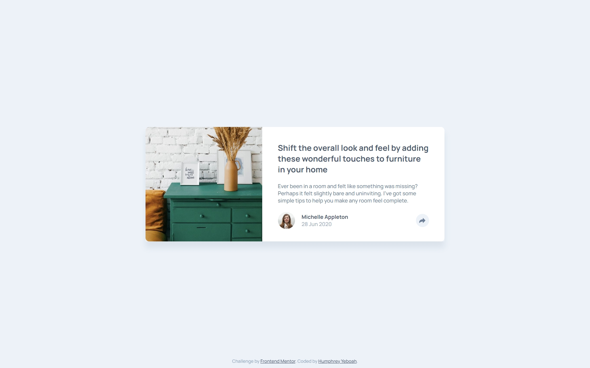
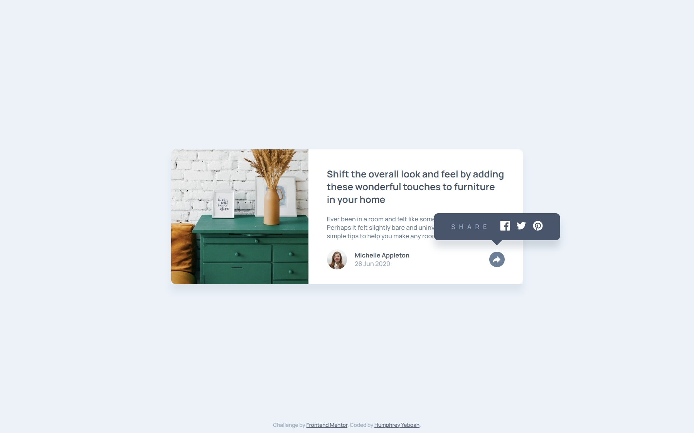
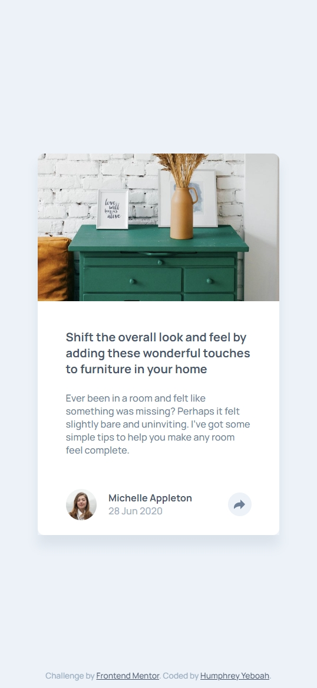
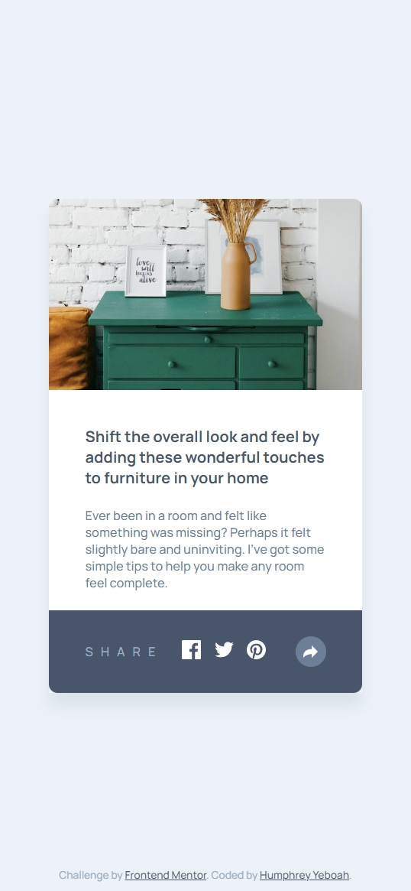

<!-- @format -->

# Frontend Mentor - Article preview component solution

This is a solution to the [Article preview component challenge on Frontend Mentor](https://www.frontendmentor.io/challenges/article-preview-component-dYBN_pYFT). Frontend Mentor challenges help you improve your coding skills by building realistic projects.

## Table of contents

- [Overview](#overview)
  - [The challenge](#the-challenge)
  - [Screenshot](#screenshot)
  - [Links](#links)
  - [States](#states)
- [My process](#my-process)
  - [Built with](#built-with)
  - [What I learned](#what-i-learned)
  - [Useful resources](#useful-resources)
- [Author](#author)

## Overview

### The challenge

Users should be able to:

- View the optimal layout for the component depending on their device's screen size
- See the social media share links when they click the share icon

### Screenshot

### Links

- Solution URL: [Github repo](https://github.com/hakylepremier/article-preview-component)
- Live Site URL: [Live site link](https://hakylepremier.github.io/article-preview-component/)

### States

#### Desktop

|                                   Non-active                                   |                                     Active                                      |
| :----------------------------------------------------------------------------: | :-----------------------------------------------------------------------------: |
|  |  |

#### Mobile

|                                        Non-active                                         |                                           Active                                           |
| :---------------------------------------------------------------------------------------: | :----------------------------------------------------------------------------------------: |
|  |  |

## My process

### Built with

- Semantic HTML5 markup
- CSS (BEM)
- Flexbox
- CSS Grid

### What I learned

I learned how to properly utilise svgs in your design

### Useful resources

- [How can I change the color of an 'svg' element?](https://stackoverflow.com/questions/22252472/how-can-i-change-the-color-of-an-svg-element) - This helped me figure out how to change the color of an svg.
- [Example resource 2](https://bennettfeely.com/clippy/) - I used this website to make the clip-path I needed for the project.

## Author

- Website - [Humphrey Yeboah](https://www.humphreyyeboah.com)
- Frontend Mentor - [@hakylepremier](https://www.frontendmentor.io/profile/hakylepremier)
- Twitter(X) - [@hakylepremier](https://www.twitter.com/hakylepremier)
